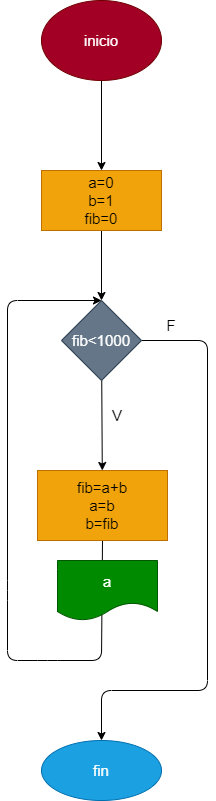

# Fibonacci

# Ejercicio N.6. repeticiones: la serie fibonacci es una serie numerica en la cual cada elemento es la suma de los dos anteriores tomando como variables los dos numeros iniciales a=0 y b=1, hacer el programa en python y diagrama de flujo que calcule e imprima a partir del tercero todos los elementos de la aserie fibonacci que sean menores de 1000

## Diagrama de flujo 
